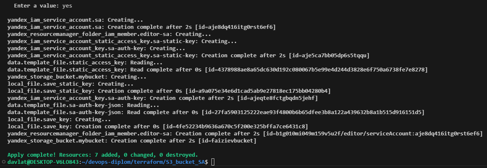
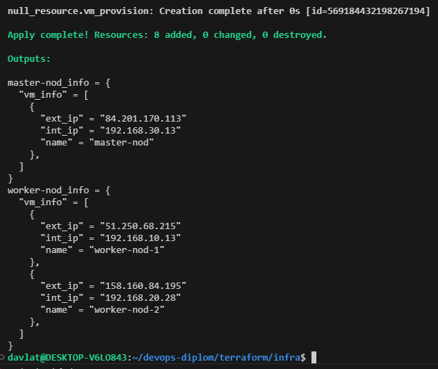
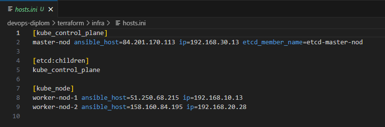
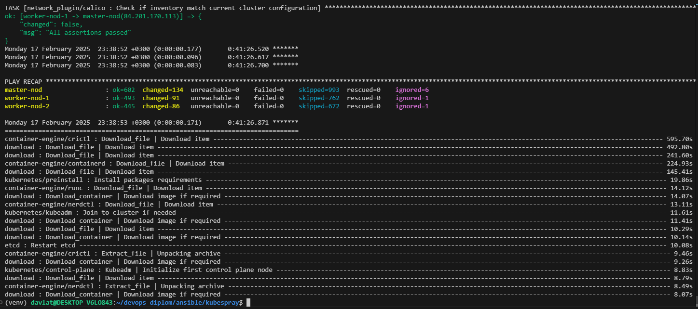
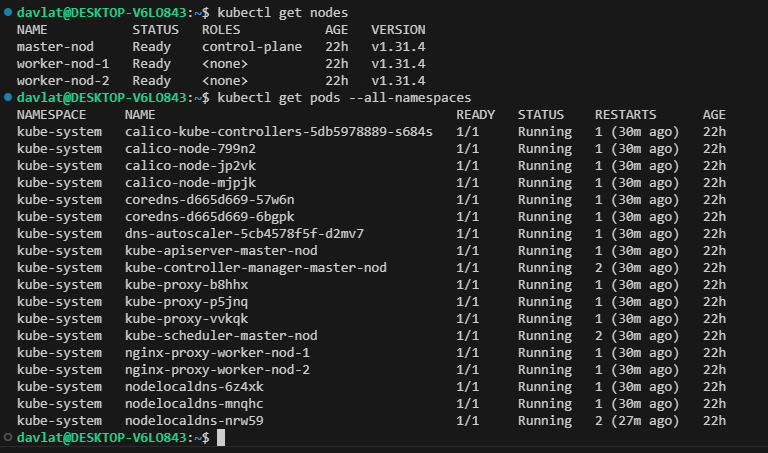
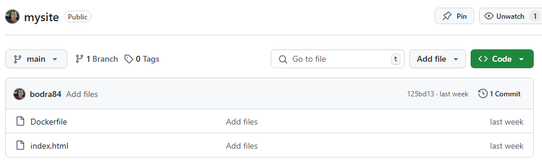
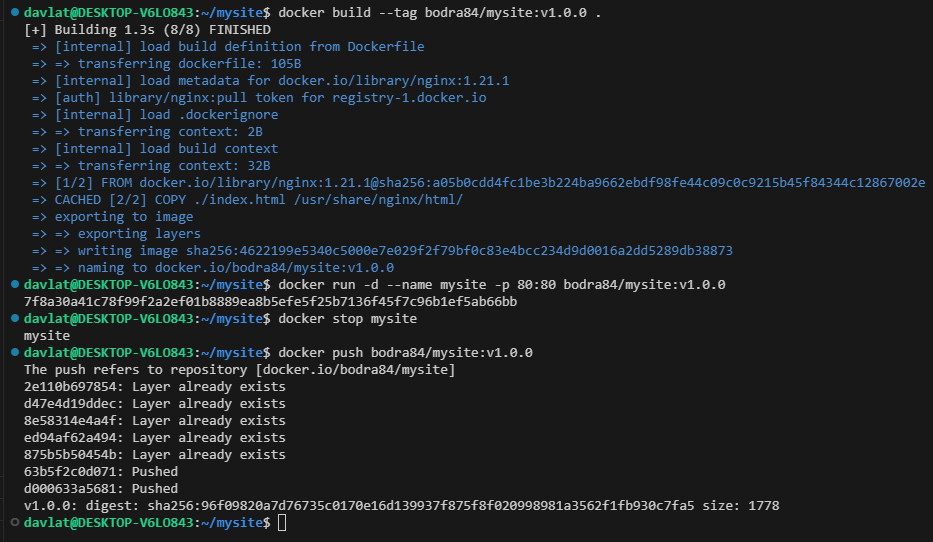
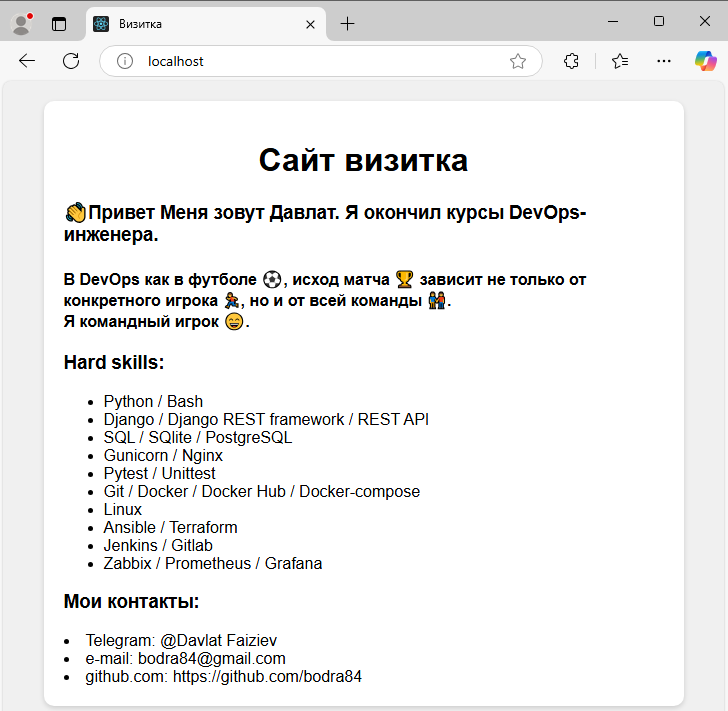
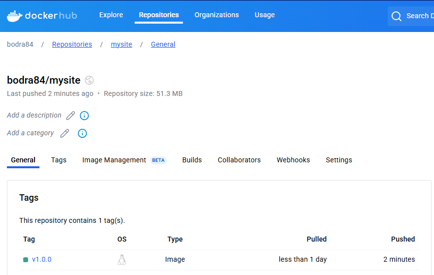

## Дипломная работа по профессии "DevOps-инженер с нуля"
### Исполнитель: Давлат Файзиев
### Дипломный руководитель: Булат Замилов
---
Дипломное задание находится по [ссылке](https://github.com/netology-code/devops-diplom-yandexcloud)  

### Подготовка к выполнению:
Для выполения дипломной работы на рабочее место были установлены следующие приложения:  
| Наименование       | Версия       |
|--------------------|--------------|
| Ubuntu на WSL      | 22.04        | 
| Visual Studio Code | 1.96.4       | 
| Terraform          | v1.8.4       | 
| Kubespray          | release-2.27 | 
| Docker             | ver. 27.3.1  |

### Создание облачной инфраструктуры
1. Управление инфраструктурой будет осуществляться сервисным аккаунтом с правами "editor", стейт файл будет храниться S3 bucket.
Для создания аккаунта и бакета необходимо перейти в папку S3_bucket_SA и выполнить команды  `terraform init` и `terraform apply`.
   
В результате выполнения кода создается сервисный аккаунт и S3 bucket.  
Чувствительные данные аккаунта сохранаются в файл `.auth-key.json`, данные доступа к бакету в файл `.credentials`.

2. Далее подготовим инфраструктуру для Kubernetes кластера. Инфраструктура будет состоять из 3-х ВМ в разных подсетях и в разных зонах доступности.
Характеристики всех ВМ будут одинаковыми:
- vCPU - 2
- RAM - 4 Гб
- disk - 20 Гб  
ВМ будут создаваться с использованием модуля `compute_instance`.  На ВМ будет создан пользователь и передан его публичный ключ при помощи cloud-config.  
Для поднятия инфраструктуры необходимо перейти в папку infra и выполнить команды  `terraform init` и `terraform apply`.  
При выполнении кода terraform будут использоваться данные аккаунта и бакета из пункта 1.  
   
В результате выполнения кода создается сеть, подсети, ВМ и файл hosts.ini со следующим содержимым для создания Kubernetes кластера.  
   

### Создание Kubernetes кластера
Для создания Kubernetes кластера используется Kubespray.  
В директорию ansible выполним установку Kubespray в соответсвии с документацией. Переключимся на ветку release-2.27.  
Скопируем папку `inventory/sample` с ее содержимым в папку `inventory/mycluster`, также скопируем туда файл hosts.ini.  
В переменную `supplementary_addresses_in_ssl_keys` в файле `inventory/mycluster/group_vars/k8s_cluster/k8s-cluster.yml` добавим внешний ip адрес master-nod-ы для добавления в ssl ключ и возможности внешнего подключения к кластеру.  
Для запуска плейбука необходимо, перейти в папку kubespray и выполнить команду:  
 `ansible-playbook -i inventory/mycluster/hosts.ini -u davlat -b -v --private-key=~/.ssh/yandxcld cluster.yml`  
   
 Скопируем файл конфигурации на master-nod-е из `/etc/kubernetes/admin.conf` в файл `~/.kube/config`, а также себе на локальную машину для внешнего подключения к кластеру.  
 Изменим владельца файла на текущего пользователя.
 На локальной машине в файле `~/.kube/config` изменим адрес сервера на внешний.  
 Проверяем:  
   

 ### Создание тестового приложения
 Репозитарий с тестовым приложением находится по ссылке https://github.com/bodra84/mysite  
 Приложение состоит из веб сервера nginx, который отдает статическую страничку index.html.  
   
 Создаем образ из докерфайла, запускаем контейнер, проверяем страничку, пушим образ на DockerHub.
  
  
  

### Подготовка cистемы мониторинга и деплой приложения