## Дипломная работа по профессии "DevOps-инженер с нуля"
### Исполнитель: Давлат Файзиев
### Дипломный руководитель: Булат Замилов
---
Дипломное задание находится по [ссылке](https://github.com/netology-code/devops-diplom-yandexcloud)  

## СОДЕРЖАНИЕ
* [Подготовка к выполнению](#подготовка-к-выполнению)
* [Создание облачной инфраструктуры](#создание-облачной-инфраструктуры)
* [Создание Kubernetes кластера](#создание-kubernetes-кластера)
* [Создание тестового приложения](#создание-облачной-инфраструктуры)
* [Подготовка cистемы мониторинга и деплой приложения](#подготовка-системы-мониторинга-и-деплой-приложения)
* [Установка и настройка CI/CD](#установка-и-настройка-cicd)
* [Результаты выполнения работы](#результаты-выполнения-работы)

### Подготовка к выполнению:
При выполнении дипломной работы использовались следующие приложения:  
| Наименование       | Версия       |
|--------------------|--------------|
| Ubuntu на WSL      | 22.04        | 
| Visual Studio Code | 1.96.4       | 
| Terraform          | v1.8.4       | 
| Kubespray          | release-2.27 | 
| Kubernetes         | v1.31.4      |
| Docker             | ver. 27.3.1  |
| Helm               | v.3.16.3     |

### Создание облачной инфраструктуры
1. Управление инфраструктурой будет осуществляться сервисным аккаунтом с правами "editor", стейт файл будет храниться S3 bucket.
Для создания аккаунта и бакета необходимо перейти в папку S3_bucket_SA и выполнить команды  `terraform init` и `terraform apply`.
   

В результате выполнения кода создается сервисный аккаунт и S3 bucket.  
Чувствительные данные аккаунта сохраняются в файл `.auth-key.json`, данные доступа к бакету в файл `.credentials`.

2. Далее подготовим инфраструктуру для Kubernetes кластера. Инфраструктура будет состоять из 3-х ВМ в разных подсетях и в разных зонах доступности.
Характеристики всех ВМ будут одинаковыми:
- vCPU - 2
- RAM - 4 Гб
- disk - 20 Гб  
ВМ будут создаваться с использованием модуля `compute_instance`.  На ВМ будет создан пользователь и передан его публичный ключ при помощи cloud-config.  
Для поднятия инфраструктуры необходимо перейти в папку infra и выполнить команды  `terraform init` и `terraform apply`.  
При выполнении кода terraform будут использоваться данные аккаунта и бакета из пункта 1.  
   

В результате выполнения кода создается сеть, подсети, ВМ и файл hosts.ini со следующим содержимым для создания Kubernetes кластера.  
   

### Создание Kubernetes кластера
Для создания Kubernetes кластера используется Kubespray.  
В директорию ansible выполним установку Kubespray в соответсвии с документацией. Переключимся на ветку release-2.27.  
Скопируем папку `inventory/sample` с ее содержимым в папку `inventory/mycluster`, также скопируем туда файл hosts.ini.  
В переменную `supplementary_addresses_in_ssl_keys` в файле `inventory/mycluster/group_vars/k8s_cluster/k8s-cluster.yml` добавим внешний ip адрес master-nod-ы для добавления в ssl ключ и возможности внешнего подключения к кластеру.  
Для запуска плейбука необходимо, перейти в папку kubespray и выполнить команду:  
 `ansible-playbook -i inventory/mycluster/hosts.ini -u davlat -b -v --private-key=~/.ssh/yandxcld cluster.yml`  
   
 
 Скопируем файл конфигурации на master-nod-е из `/etc/kubernetes/admin.conf` в файл `~/.kube/config`, а также себе на локальную машину для внешнего подключения к кластеру.  
 Изменим владельца файла на текущего пользователя.
 На локальной машине в файле `~/.kube/config` изменим адрес сервера на внешний.  
 Проверяем:  
   

 ### Создание тестового приложения
 Репозитарий с тестовым приложением находится по ссылке https://github.com/bodra84/mysite  
 Приложение состоит из веб сервера nginx, который отдает статическую страничку index.html.  
   
 
 Создаем образ из докерфайла, запускаем контейнер, проверяем страничку, пушим образ на DockerHub.
  
  
  

### Подготовка системы мониторинга и деплой приложения
1. Для деплоя в кластер системы мониторинга воспользуемся helm чартом kube-prometheus-stack из репозитария [prometheus-community](https://github.com/prometheus-community).  

Добавим репозиторий командой:  
`helm repo add prometheus-community https://prometheus-community.github.io/helm-charts`  
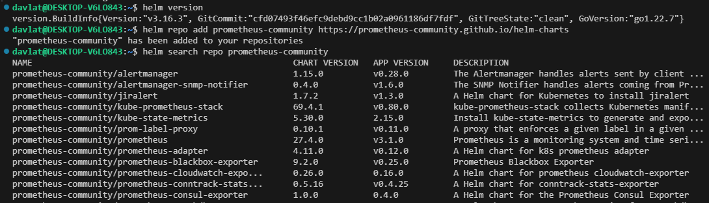  

Обновим репозитарии:  
`helm repo update`  

Сохраним файл конфигурации:  
`helm show values prometheus-community/kube-prometheus-stack > values.yml`  
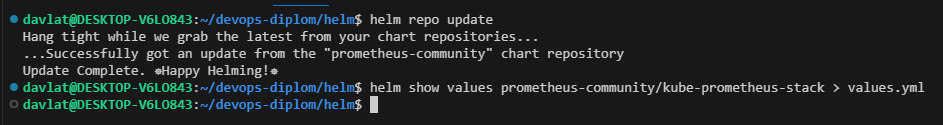  

В файле изменим пароль администратора и параметры сервиса grafana.  
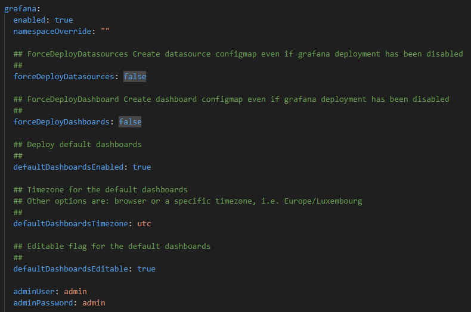  

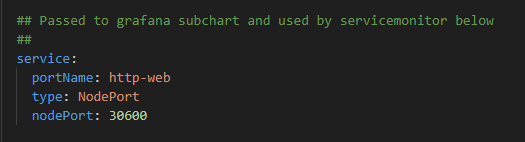  
Файл конфигурации находится по ссылке [values.yml](helm/values.yml)  

Далее установим чарт применив файл конфигурации.  
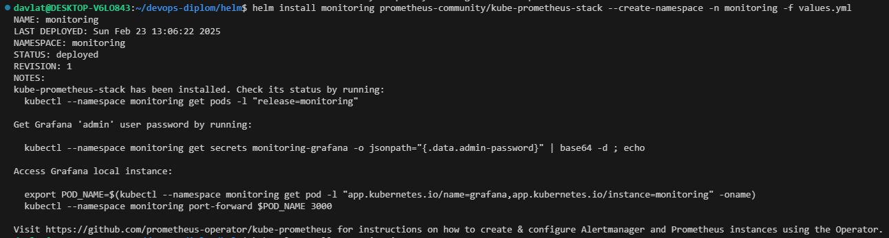   

Проверим:  
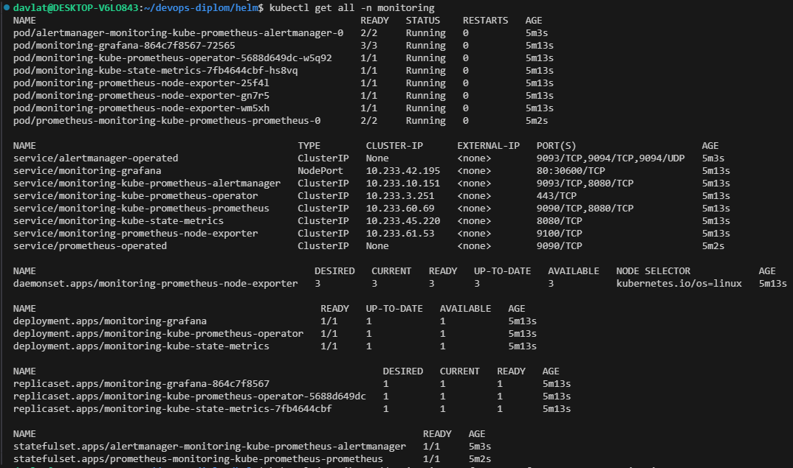  

Для доступа к web интерфейсу grafana и к приложению mysite на 80 порту, а также для балансировки нагрузки между нодами, создадим два сетевых балансировщика и подключим к ним таргет группы, состоящие из наших нод.  
Код для создания данных ресурсов добавлен в файл main.tf в папке [infra](./terraform/infra/). 
При отправке кода в удаленный репозитарий запустится workflow GitHub Actions, который запустит процесс CI/CD и создаст в Яндекс клауд необходимые ресурсы.
Чтобы workflow отработал в GitHub были добавлены необходимые переменные в secrets.  
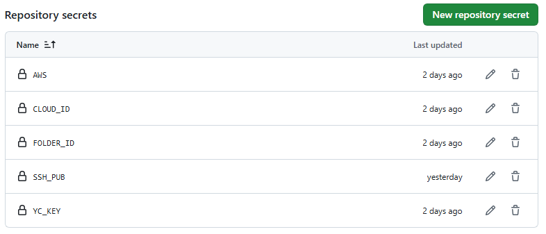  

Также пайплайном предусмотрено ручное применение конфигурации terraform, а также ее удаление при необходимости.  
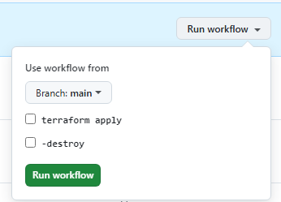  

Процесс применения конфигурации terraform представлен на скриншоте:  
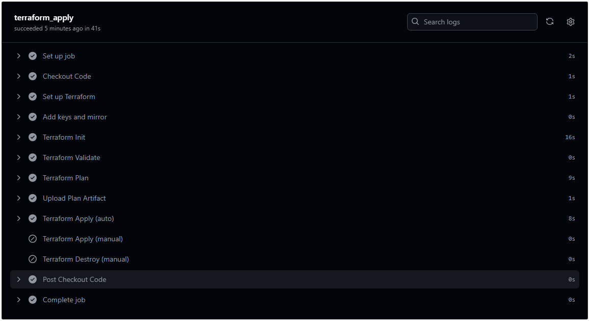  

Пайплайн в процессе своей работы сохраняет в артефакты терраформ план.  
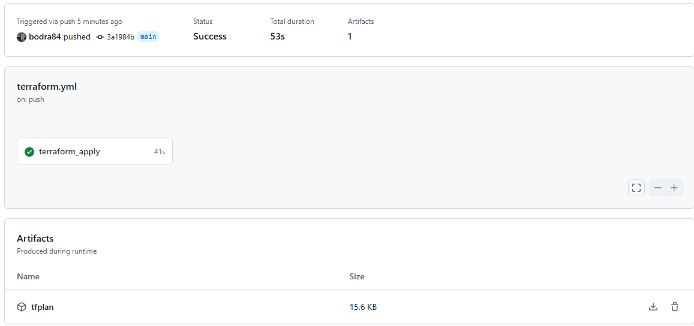  

Скриншот отработанного пайплайна с выводом терраформ outputs:  
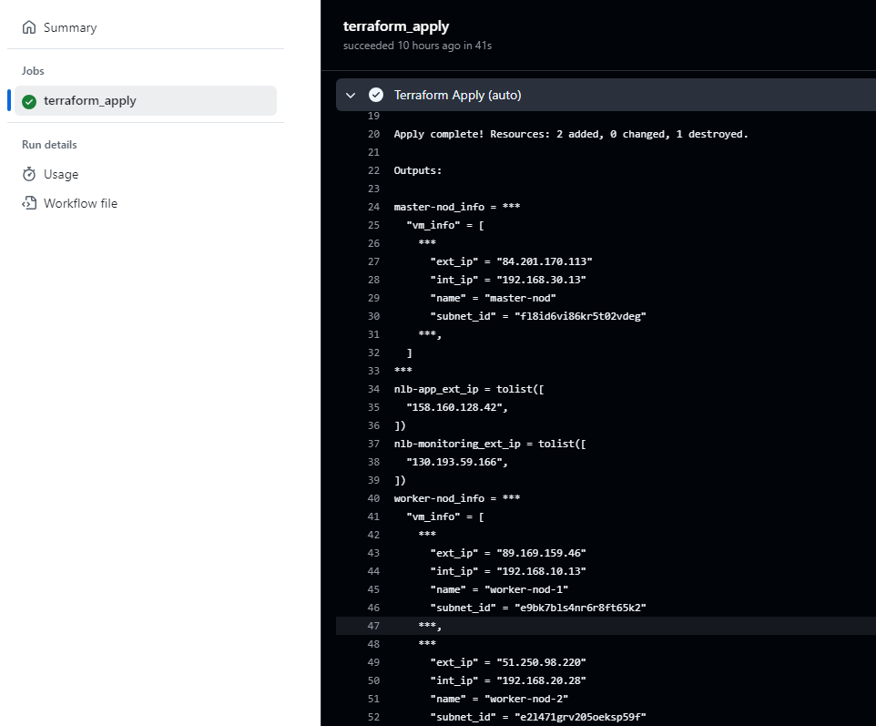  

Скриншот доступа к интерфейсу grafana через балансировщик с настроенным дашбордом:  
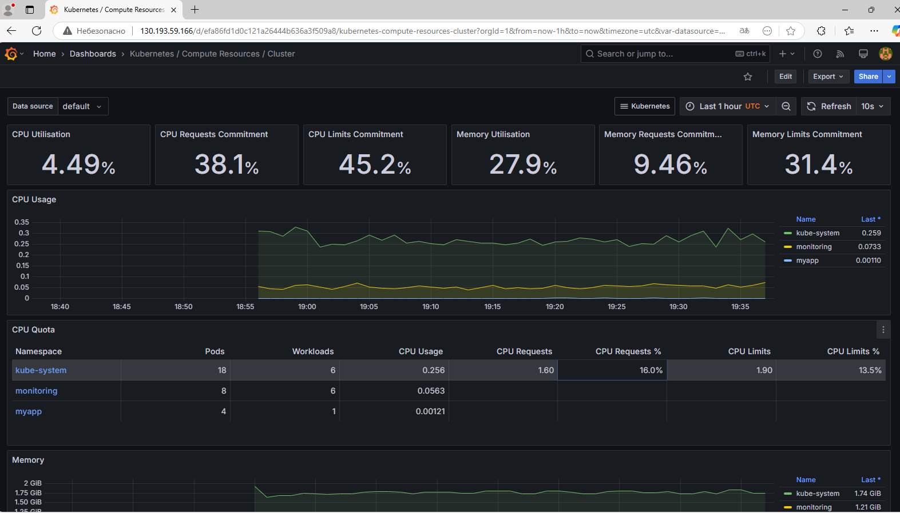  

2. Для деплоя в кластер приложения будем использовать yaml файлы с манифестами сущностей deployment и service.
Файлы находятся в папке [k8s](https://github.com/bodra84/mysite/tree/main/k8s) репозитария с приложением mysite.

Применим данные манифесты и посмотрим их состояние:  
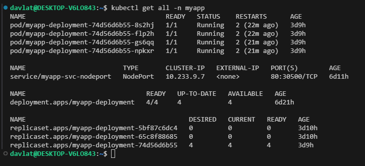  

Скриншот доступа к интерфейсу mysite через балансировщик:  
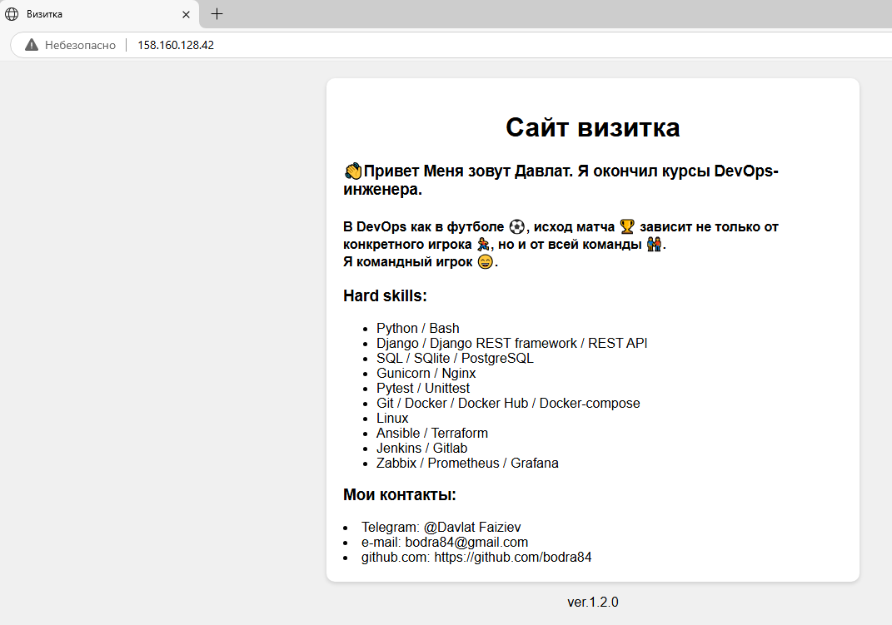  

### Установка и настройка CI/CD
Для автоматизации процесса сборки и деплоя приложения в репозитарии приложения создадим workflow который будет билдить и деплоить приложение в зависимости следующих условий:
- выполнит build образа приложения в DockerHub - при выполнении `push` в ветку `main` репозитария
- выполнит build & deploy при тегировании коммита тегом вида `v.*`

Ссылка на сам [workflow](https://github.com/bodra84/mysite/blob/main/.github/workflows/build_deploy_app.yml).

Также добавим необходимые переменные в secrets.  
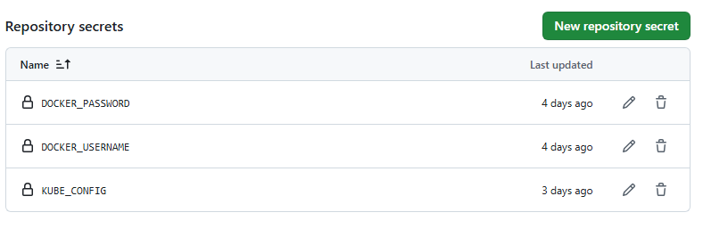  

Проверим:  
Изменим текст в конце файла index.html с ver.1.2.0 на ver.1.3.0.
Добавим файл в `staged` и создадим коммит с названием `build app`.  
Выполнил `push` данного коммита в ветку `main`.  
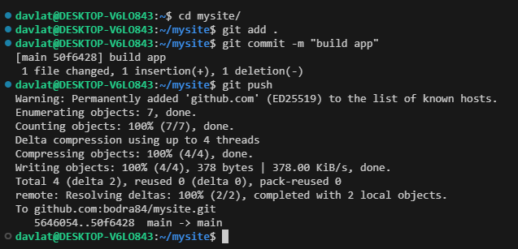  

Посмотрим на пайплайн. Видим что стейдж `Deploy to Kubernetes` не выполнился.  
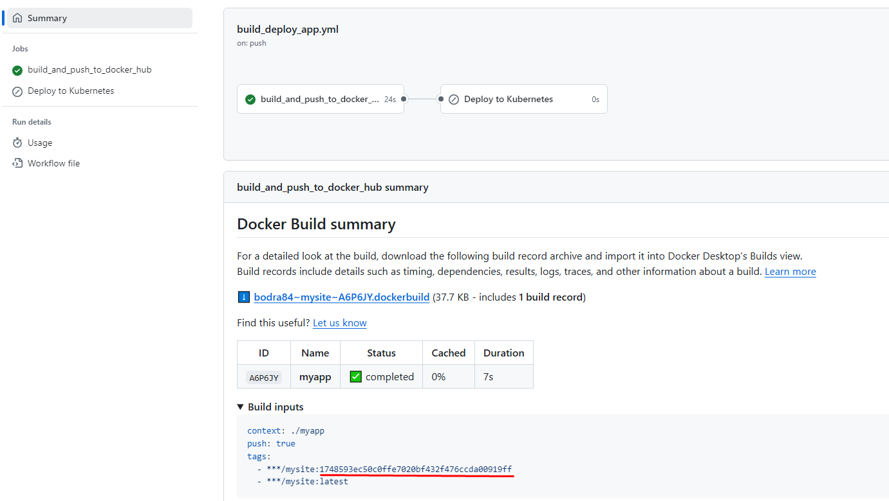   

В DockerHub создается два образа с тегами latest и с хешом коммита.  
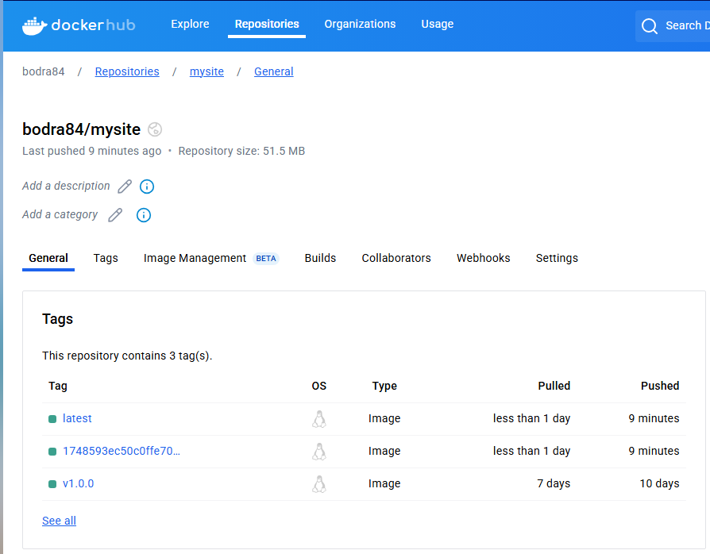  

Теперь добавим тег v1.3.0 этому коммиту и отправим его в репозитарий:  
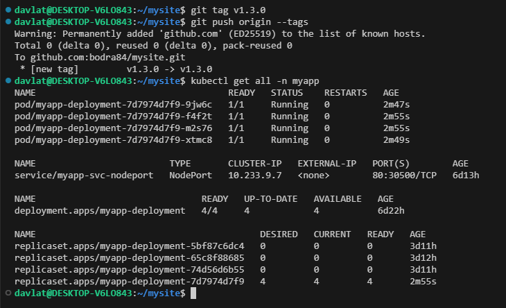  

Видим, что запустился пайплайн:  
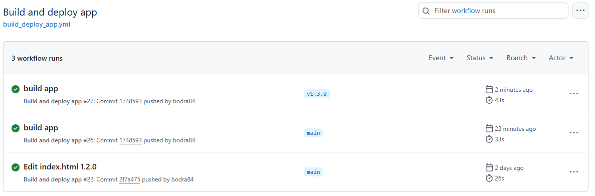  

Выполнились два стейджа build и deploy:  
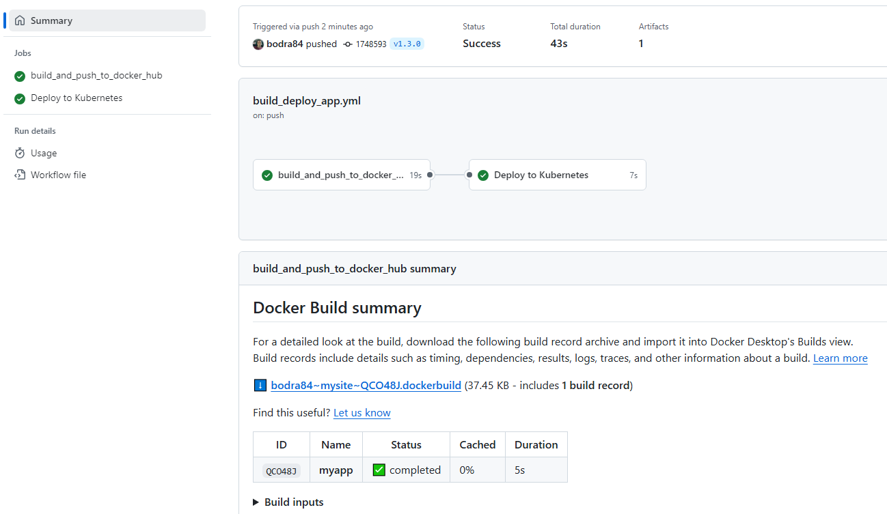  

Проверяем страничку приложения mysite через балансировщик:   
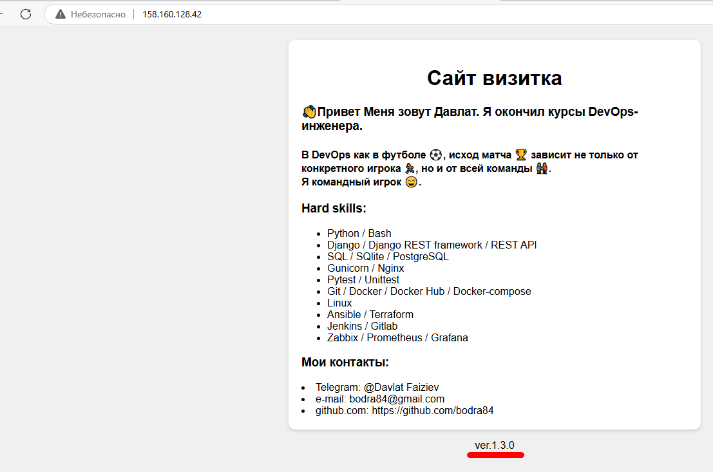  

Как видим, страничка изменилась, результат достигнут.

### Результаты выполнения работы:
1. Репозитарий с кодом терраформ и настройками мониторинга k8s кластера [devops-diplom](https://github.com/bodra84/devops-diplom)  
2. Репозитарий тестового приложения [mysite](https://github.com/bodra84/mysite/)  
3. Репозитарий [DockerHub](https://hub.docker.com/repository/docker/bodra84/mysite/general)  
4. Ссылка на работающее тестовое приложение [http://158.160.128.42/](http://158.160.128.42/) 
5. Ссылка на веб интерфейс Grafana (login: admin password: admin) [http://130.193.59.166/](http://130.193.59.166/)